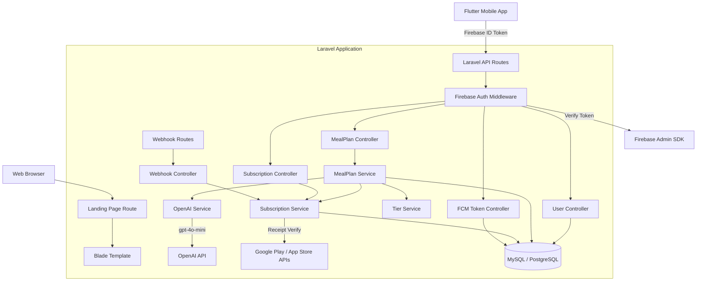
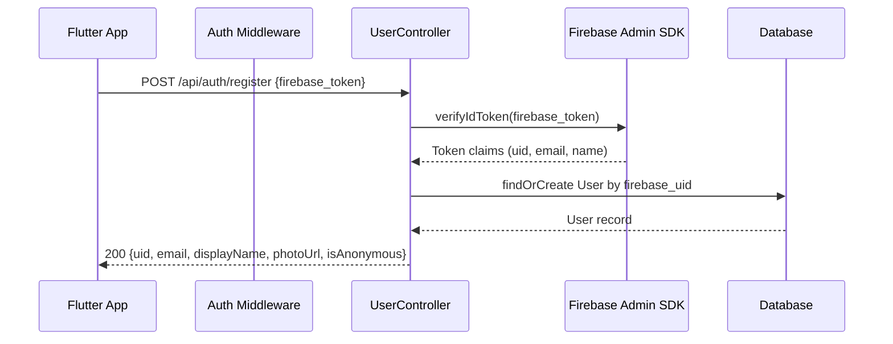
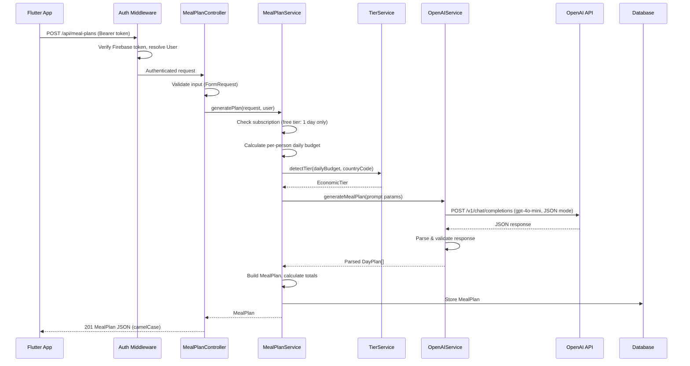
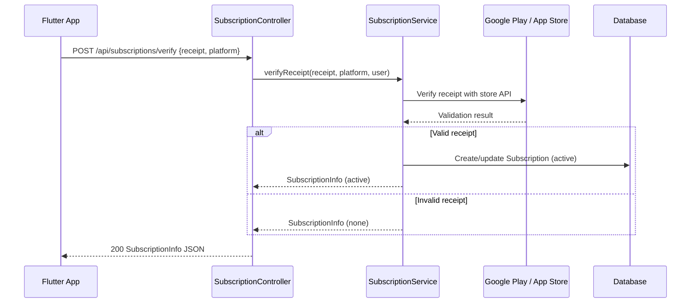
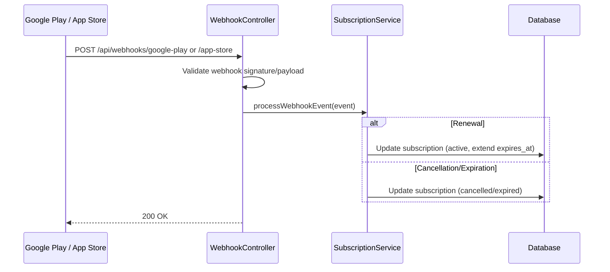

# Design Document: BudgetBite Laravel API & Landing Page

## Overview

The BudgetBite Laravel API is the server-side backend for the Food Budget: Survival Mode Flutter mobile app. Built on the existing Laravel 12 Livewire starter kit, it adds Firebase token authentication, AI-powered meal plan generation via OpenAI GPT (gpt-4o-mini), meal plan storage in MySQL/PostgreSQL, subscription management with receipt verification and webhook processing for Google Play and App Store, FCM token registration, rate limiting, economic tier detection, and free tier enforcement. It also serves a public landing page at the root URL. The Flutter app communicates exclusively via authenticated REST API endpoints using Firebase ID tokens as Bearer tokens.

## Architecture



### Layer Breakdown

- **Routing Layer**: API routes (`routes/api.php`) for REST endpoints, web routes (`routes/web.php`) for landing page. Webhook routes are unauthenticated but signature-validated.
- **Middleware Layer**: `FirebaseAuthMiddleware` verifies Firebase ID tokens on all API routes except registration and webhooks.
- **Controller Layer**: Thin controllers handling HTTP request/response, validation, and delegating to services.
- **Service Layer**: Business logic for meal plan generation, subscription management, tier detection, and OpenAI interaction.
- **Model Layer**: Eloquent models for User, MealPlan, Subscription, FcmToken with relationships and JSON casting.
- **Config Layer**: Environment-driven configuration for Firebase credentials, OpenAI API key, store API keys, rate limits, and tier thresholds.

## Sequence Diagrams

### Firebase Auth + User Registration



### Meal Plan Generation



### Subscription Verification



### Webhook Processing



## Components and Interfaces

### Component 1: FirebaseAuthMiddleware

**Purpose**: Verifies Firebase ID tokens on incoming API requests and resolves the authenticated User.

```php
class FirebaseAuthMiddleware
{
    // Extracts Bearer token from Authorization header
    // Verifies token via kreait/firebase-php
    // Resolves User by firebase_uid from database
    // Rejects with 401 if token invalid/expired or user not found
    // Sets authenticated user on request for downstream controllers
    public function handle(Request $request, Closure $next): Response;
}
```

### Component 2: UserController

**Purpose**: Handles user registration/sync via Firebase tokens.

```php
class UserController extends Controller
{
    // POST /api/auth/register
    // Verifies firebase_token, creates or updates User record
    // Returns AuthUser JSON (uid, email, displayName, photoUrl, isAnonymous)
    public function register(RegisterRequest $request): JsonResponse;
}
```

### Component 3: MealPlanController

**Purpose**: Handles meal plan generation and day regeneration.

```php
class MealPlanController extends Controller
{
    // POST /api/meal-plans
    // Validates input via FormRequest, delegates to MealPlanService
    // Returns 201 with MealPlan JSON
    public function store(GenerateMealPlanRequest $request): JsonResponse;

    // POST /api/meal-plans/{planId}/days/{dayIndex}/regenerate
    // Validates ownership and dayIndex range
    // Returns 200 with DayPlan JSON
    public function regenerateDay(Request $request, string $planId, int $dayIndex): JsonResponse;
}
```

### Component 4: SubscriptionController

**Purpose**: Handles subscription verification, status, and restore.

```php
class SubscriptionController extends Controller
{
    // POST /api/subscriptions/verify
    public function verify(VerifySubscriptionRequest $request): JsonResponse;

    // GET /api/subscriptions/status
    public function status(Request $request): JsonResponse;

    // POST /api/subscriptions/restore
    public function restore(RestoreSubscriptionRequest $request): JsonResponse;
}
```

### Component 5: WebhookController

**Purpose**: Processes incoming webhooks from Google Play and App Store.

```php
class WebhookController extends Controller
{
    // POST /api/webhooks/google-play
    public function googlePlay(Request $request): JsonResponse;

    // POST /api/webhooks/app-store
    public function appStore(Request $request): JsonResponse;
}
```

### Component 6: FcmTokenController

**Purpose**: Manages FCM device token registration and removal.

```php
class FcmTokenController extends Controller
{
    // POST /api/fcm-tokens
    public function store(StoreFcmTokenRequest $request): JsonResponse;

    // DELETE /api/fcm-tokens
    public function destroy(DestroyFcmTokenRequest $request): JsonResponse;
}
```

### Component 7: MealPlanService

**Purpose**: Orchestrates meal plan generation: validation, subscription check, budget calculation, tier detection, OpenAI call, parsing, and storage.

```php
class MealPlanService
{
    public function generatePlan(array $params, User $user): MealPlan;
    public function regenerateDay(MealPlan $plan, int $dayIndex): array;
    public function calculateDailyBudget(float $totalBudget, int $days, int $persons): float;
}
```

### Component 8: OpenAIService

**Purpose**: Builds structured prompts and calls the OpenAI GPT API, parses responses.

```php
class OpenAIService
{
    public function generateMealPlan(array $promptParams): array;
    public function regenerateDay(array $promptParams, array $originalDay): array;
    // Retries up to 3 times on rate limit/server errors
    // Retries up to 2 additional times on malformed JSON
}
```

### Component 9: SubscriptionService

**Purpose**: Handles receipt verification with store APIs and subscription record management.

```php
class SubscriptionService
{
    public function verifyReceipt(string $receipt, string $platform, User $user): Subscription;
    public function restorePurchase(string $receipt, string $platform, User $user): Subscription;
    public function getStatus(User $user): Subscription;
    public function processWebhookEvent(string $platform, array $payload): void;
    public function isActive(User $user): bool;
}
```

### Component 10: TierService

**Purpose**: Maps per-person daily budgets to economic tiers using country-specific thresholds.

```php
class TierService
{
    public function detectTier(float $dailyBudgetPerPerson, string $countryCode): string;
    public function getThresholds(string $countryCode): array;
}
```

## Data Models

### User (Eloquent)

```php
// Table: users
// id, firebase_uid (unique, indexed), email (nullable), display_name (nullable),
// country (nullable), created_at, updated_at
class User extends Authenticatable
{
    protected $fillable = ['firebase_uid', 'email', 'display_name', 'country'];

    public function mealPlans(): HasMany;
    public function subscription(): HasOne;
    public function fcmTokens(): HasMany;
}
```

### MealPlan (Eloquent)

```php
// Table: meal_plans
// id (UUID), user_id (FK), request_json (JSON), days_json (JSON),
// total_cost (decimal 10,2), remaining_budget (decimal 10,2),
// detected_tier (string), created_at, updated_at
class MealPlan extends Model
{
    use HasUuids;

    protected $casts = [
        'request_json' => 'array',
        'days_json' => 'array',
        'total_cost' => 'decimal:2',
        'remaining_budget' => 'decimal:2',
    ];

    public function user(): BelongsTo;
}
```

### Subscription (Eloquent)

```php
// Table: subscriptions
// id, user_id (FK, unique), product_id (nullable), platform (nullable),
// status (enum: active, expired, cancelled, none),
// receipt (text, nullable), expires_at (nullable), purchased_at (nullable),
// created_at, updated_at
class Subscription extends Model
{
    protected $casts = [
        'expires_at' => 'datetime',
        'purchased_at' => 'datetime',
    ];

    public function user(): BelongsTo;
    public function isActive(): bool;
}
```

### FcmToken (Eloquent)

```php
// Table: fcm_tokens
// id, user_id (FK), token (string, indexed), platform (string),
// created_at, updated_at
// Unique constraint: user_id + token
class FcmToken extends Model
{
    public function user(): BelongsTo;
}
```

## API Response Contracts (camelCase)

### AuthUser Response
```json
{
    "uid": "firebase_uid_string",
    "email": "user@example.com",
    "displayName": "User Name",
    "photoUrl": null,
    "isAnonymous": false
}
```

### MealPlan Response
```json
{
    "id": "uuid-string",
    "userId": "firebase_uid",
    "request": {
        "totalBudget": 5000.0,
        "currencyCode": "PHP",
        "numberOfDays": 7,
        "numberOfPersons": 4,
        "startDate": "2025-01-15",
        "countryCode": "PH",
        "preferredTier": null,
        "skippedMealTypes": []
    },
    "days": [
        {
            "dayIndex": 0,
            "date": "2025-01-15",
            "meals": [
                {
                    "type": "breakfast",
                    "name": "Sinangag with Tuyo",
                    "description": "Garlic fried rice with dried fish",
                    "ingredients": ["rice", "garlic", "tuyo"],
                    "estimatedCost": 35.0,
                    "isSkipped": false,
                    "isBasicMeal": false
                }
            ],
            "dailyCost": 160.0
        }
    ],
    "totalCost": 1120.0,
    "remainingBudget": 3880.0,
    "detectedTier": "poor",
    "createdAt": "2025-01-15T08:00:00Z",
    "updatedAt": "2025-01-15T08:00:00Z"
}
```

### DayPlan Response (regeneration)
```json
{
    "dayIndex": 0,
    "date": "2025-01-15",
    "meals": [],
    "dailyCost": 160.0
}
```

### SubscriptionInfo Response
```json
{
    "userId": "firebase_uid",
    "status": "active",
    "productId": "premium_monthly",
    "platform": "android",
    "expiresAt": "2025-02-15T08:00:00Z",
    "purchasedAt": "2025-01-15T08:00:00Z"
}
```

### Error Responses
```json
// 422 Validation Error
{ "message": "The given data was invalid.", "errors": { "totalBudget": ["The total budget must be greater than 0."] } }

// 401 Unauthorized
{ "message": "Unauthenticated." }

// 403 Forbidden
{ "message": "Subscription required for multi-day plans." }

// 429 Rate Limited
{ "message": "Too many requests." }

// 500 Server Error
{ "message": "An unexpected error occurred." }

// 503 Service Unavailable
{ "message": "Meal plan generation is temporarily unavailable." }
```

## Configuration

### Environment Variables
```
OPENAI_API_KEY=sk-...
FIREBASE_CREDENTIALS=/path/to/firebase-service-account.json
GOOGLE_PLAY_KEY_FILE=/path/to/google-play-key.json
APPSTORE_SHARED_SECRET=...
MEALPLAN_RATE_LIMIT=10
MEALPLAN_RATE_LIMIT_WINDOW=60
REGENERATE_RATE_LIMIT=20
REGENERATE_RATE_LIMIT_WINDOW=60
```

### Tier Thresholds Config (`config/tiers.php`)
```php
return [
    'default' => [
        'poor_min' => 2.15,      // USD World Bank extreme poverty line
        'middle_class_min' => 10,
        'rich_min' => 50,
    ],
    'countries' => [
        'PH' => [
            'poor_min' => 100,    // PHP
            'middle_class_min' => 250,
            'rich_min' => 800,
        ],
        // Add more countries as needed
    ],
];
```

## Key Algorithms

### Per-Person Daily Budget Calculation

```php
function calculateDailyBudget(float $totalBudget, int $days, int $persons): float
{
    return $totalBudget / ($days * $persons);
}
// Postcondition: result > 0, result * days * persons <= totalBudget
```

### Economic Tier Detection

```php
function detectTier(float $dailyBudgetPerPerson, string $countryCode): string
{
    $thresholds = config("tiers.countries.{$countryCode}", config('tiers.default'));

    if ($dailyBudgetPerPerson < $thresholds['poor_min']) {
        return 'extremePoverty';
    } elseif ($dailyBudgetPerPerson < $thresholds['middle_class_min']) {
        return 'poor';
    } elseif ($dailyBudgetPerPerson < $thresholds['rich_min']) {
        return 'middleClass';
    }
    return 'rich';
}
// Property: monotonic — higher budget never maps to lower tier
```

### OpenAI Retry Logic

```php
function callOpenAI(array $messages, int $maxRetries = 3): array
{
    for ($attempt = 1; $attempt <= $maxRetries; $attempt++) {
        try {
            $response = $this->client->chat()->create([...]);
            $parsed = json_decode($response->choices[0]->message->content, true);
            if ($parsed === null) throw new MalformedResponseException();
            return $parsed;
        } catch (RateLimitException | ServerException $e) {
            if ($attempt === $maxRetries) throw $e;
            sleep(pow(2, $attempt)); // exponential backoff
        } catch (MalformedResponseException $e) {
            if ($attempt === $maxRetries) throw $e;
        }
    }
}
```

## Correctness Properties

### Property 1: Budget Constraint
For any generated MealPlan, `totalCost <= request.totalBudget` and `remainingBudget >= 0`.

### Property 2: Day Count Integrity
For any generated MealPlan, `count(days) == request.numberOfDays`.

### Property 3: Budget Accounting
`remainingBudget == totalBudget - totalCost` for all meal plans.

### Property 4: Daily Cost Summation
`totalCost == sum(days[*].dailyCost)` for all meal plans.

### Property 5: Meal Type Completeness
Each DayPlan with no skipped types contains exactly 4 meals (breakfast, lunch, dinner, meryenda).

### Property 6: Skipped Meal Invariants
Skipped meals have `isSkipped == true`, `estimatedCost == 0`, empty ingredients. Entry still exists.

### Property 7: Date Sequence
`days[i].date == startDate + i days` and `days[i].dayIndex == i`.

### Property 8: Tier Monotonicity
For budgets A < B with same country, `tier(A).index <= tier(B).index`.

### Property 9: Free Tier Enforcement
Non-subscribed users requesting `numberOfDays > 1` receive 403.

### Property 10: JSON Serialization Round Trip
Storing and retrieving a MealPlan produces equivalent data.

## Error Handling

| Scenario | Response | Recovery |
|---|---|---|
| Invalid/expired Firebase token | 401 Unauthorized | Client refreshes token and retries |
| User not registered | 401 Unauthorized | Client calls POST /api/auth/register first |
| Invalid input parameters | 422 with field errors | Client corrects fields |
| Non-subscriber requests multi-day | 403 Forbidden | Client shows subscription paywall |
| Rate limit exceeded | 429 with Retry-After | Client waits and retries |
| OpenAI rate limit (429) | Retry with backoff, then 503 | Automatic retry, client retries later |
| OpenAI server error (500/503) | Retry with backoff, then 503 | Automatic retry |
| OpenAI malformed response | Retry up to 2x, then 503 | Automatic retry |
| Invalid webhook signature | 400 Bad Request | Store retries webhook |
| Invalid subscription receipt | Return status: none | Client shows appropriate UI |
| Unhandled exception | 500 generic message | Logged for debugging |

## Landing Page Design

The landing page is a single Blade template at `GET /` with:
- Hero section: app name, Bitey mascot, tagline
- Features section: AI meals, budget-aware, country-specific, tier detection, multi-day
- How It Works: 4 steps (set budget → choose days/persons → AI generates → follow plan)
- Download badges: Google Play and App Store links
- Footer: privacy policy, terms of service links
- Responsive, mobile-friendly, Tailwind CSS (already in project), no JS framework
- SEO meta tags for discoverability
- Light pastel theme consistent with Flutter app branding

## Security Considerations

- Firebase ID tokens verified server-side on every API request via kreait/firebase-php
- OpenAI API key stored in `.env`, never exposed in responses or logs
- All inputs validated via Laravel FormRequest classes
- CORS configured for authorized origins only
- Rate limiting on generation endpoints via Laravel's built-in throttle middleware
- Webhook endpoints validate signatures/payloads before processing
- Sensitive data (API keys, tokens, receipts) never logged
- HTTPS enforced for all API communication
