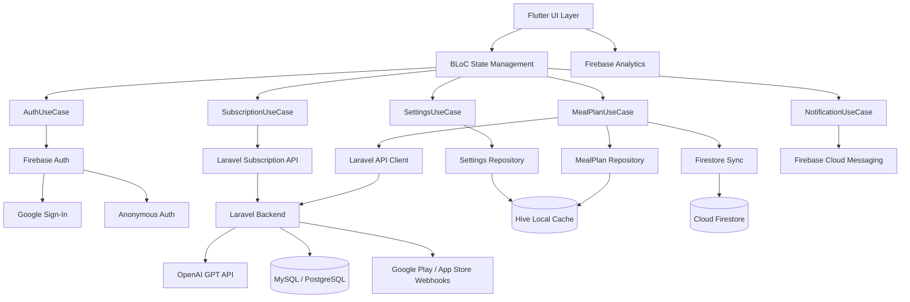
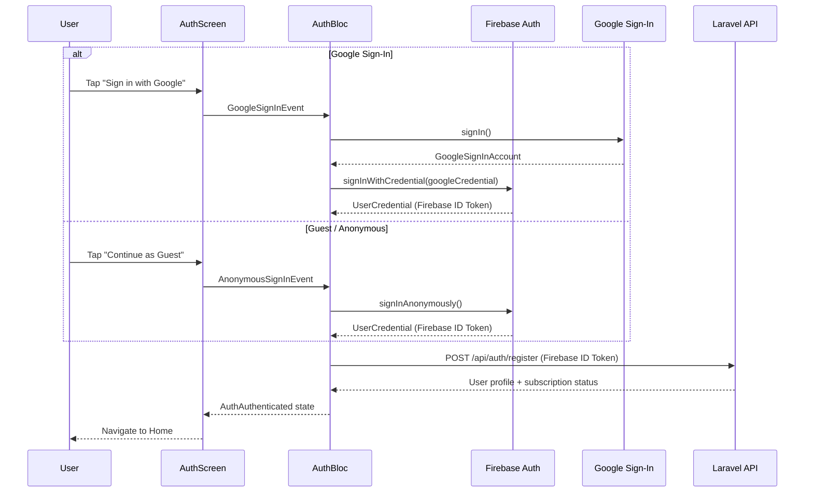
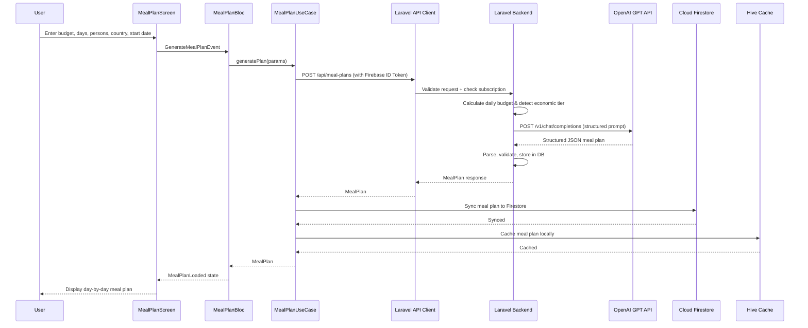
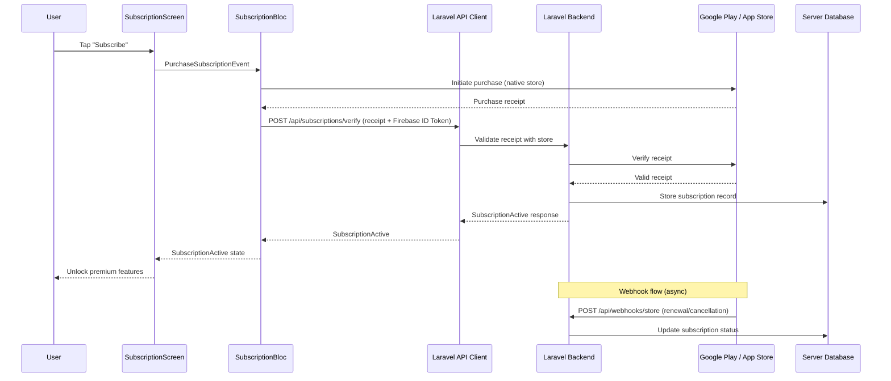
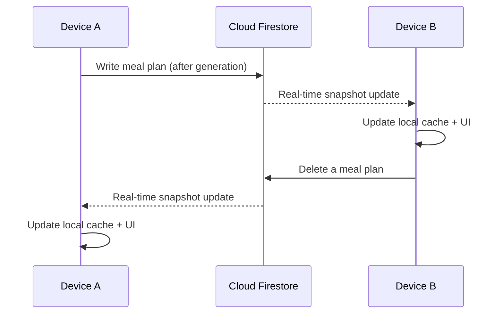

# Design Document: Food Budget Planner

## Overview

Food Budget Planner (Food Budget: Survival Mode) is a cross-platform Flutter mobile app that helps users plan meals within a set budget. The user inputs a budget amount, number of days (up to 30), number of people eating, and a start date. The app sends this request to a Laravel API backend, which calls the OpenAI GPT API to generate a day-by-day meal plan (breakfast, lunch, dinner, and meryenda/snacks) tailored to the user's economic tier and country.

The app uses Firebase for authentication (Google Sign-In and Guest/Anonymous auth), Firestore for real-time sync of meal plans across devices, Firebase Analytics for usage tracking, and Firebase Cloud Messaging for push notifications. The Laravel backend handles all AI meal generation (via OpenAI GPT), server-side data storage (MySQL/PostgreSQL), and subscription management including webhook processing from Google Play and App Store.

There is no local food database — all meal suggestions are generated dynamically by the AI through the Laravel backend. Hive is retained only for local caching and offline support of previously synced meal plans. The UI follows a clean, light design theme with a cute beaver mascot named "Bitey". Internet connectivity is required for meal plan generation and sync, but cached plans are available offline.

## Architecture



### Layer Breakdown

- **UI Layer**: Flutter widgets, screens, navigation. Light theme with beaver mascot "Bitey" branding.
- **BLoC Layer**: Business Logic Components managing state for auth, meal plans, settings, subscriptions, and notifications.
- **Use Case Layer**: Domain logic orchestrating Firebase auth, Laravel API calls, Firestore sync, plan CRUD, and subscription checks.
- **Repository Layer**: Abstractions over local cache, Firebase services, Laravel API, and platform services.
- **Data Layer**:
  - **Firebase Auth** — Google Sign-In and Anonymous authentication
  - **Cloud Firestore** — Real-time sync of meal plans across devices
  - **Firebase Analytics** — Usage tracking and event logging
  - **Firebase Cloud Messaging** — Push notifications
  - **Laravel Backend** — AI meal generation (OpenAI GPT), server-side storage (MySQL/PostgreSQL), subscription management (webhooks)
  - **Hive** — Local caching for offline access to previously synced plans and settings


## Sequence Diagrams

### Authentication Flow



### Meal Plan Generation Flow



### Subscription Management Flow



### Real-Time Sync Flow




## Components and Interfaces

### Component 1: Auth Repository (Firebase Auth)

**Purpose**: Manages user authentication via Firebase Auth, supporting Google Sign-In and Anonymous/Guest authentication.

```dart
abstract class AuthRepository {
  /// Sign in with Google
  Future<AuthUser> signInWithGoogle();

  /// Sign in anonymously (guest mode)
  Future<AuthUser> signInAnonymously();

  /// Get current authenticated user
  AuthUser? get currentUser;

  /// Get Firebase ID token for API authentication
  Future<String> getIdToken();

  /// Sign out
  Future<void> signOut();

  /// Stream of auth state changes
  Stream<AuthUser?> get authStateChanges;

  /// Link anonymous account to Google account
  Future<AuthUser> linkWithGoogle();
}

class AuthUser {
  final String uid;
  final String? email;
  final String? displayName;
  final String? photoUrl;
  final bool isAnonymous;
}
```

**Responsibilities**:
- Firebase Auth initialization and configuration
- Google Sign-In flow
- Anonymous/Guest authentication
- Firebase ID token retrieval for Laravel API calls
- Auth state change stream for reactive UI updates
- Account linking (anonymous → Google)

### Component 2: Laravel API Client

**Purpose**: Communicates with the Laravel backend for meal plan generation, subscription management, and user data. All requests are authenticated via Firebase ID tokens.

```dart
abstract class LaravelApiClient {
  /// Register/sync user with Laravel backend
  Future<UserProfile> registerUser(String firebaseIdToken);

  /// Generate a complete meal plan via Laravel → OpenAI
  Future<MealPlan> generateMealPlan(MealPlanRequest request);

  /// Regenerate meals for a specific day
  Future<DayPlan> regenerateDay(RegenerateDayRequest request);

  /// Verify subscription receipt
  Future<SubscriptionInfo> verifySubscription(String receipt, String platform);

  /// Get current subscription status
  Future<SubscriptionInfo> getSubscriptionStatus();

  /// Restore purchases
  Future<SubscriptionInfo> restorePurchases(String receipt, String platform);
}
```

**Responsibilities**:
- Attach Firebase ID token to all API requests (Bearer token)
- Send meal plan generation requests to Laravel backend
- Handle subscription verification and status checks
- Retry with exponential backoff on transient failures
- Handle API errors (401, 403, 429, 500, network failures)

### Component 3: Firestore Sync Repository

**Purpose**: Manages real-time synchronization of meal plans across devices using Cloud Firestore.

```dart
abstract class FirestoreSyncRepository {
  /// Sync a meal plan to Firestore
  Future<void> syncMealPlan(String userId, MealPlan plan);

  /// Listen to real-time meal plan updates
  Stream<List<MealPlan>> watchMealPlans(String userId);

  /// Delete a meal plan from Firestore
  Future<void> deleteMealPlan(String userId, String planId);

  /// Update a specific day in a synced plan
  Future<void> updateDayPlan(String userId, String planId, int dayIndex, DayPlan day);

  /// Sync settings to Firestore
  Future<void> syncSettings(String userId, AppSettings settings);

  /// Watch settings changes
  Stream<AppSettings> watchSettings(String userId);
}
```

**Responsibilities**:
- Real-time sync of meal plans across user's devices
- Firestore document structure management
- Conflict resolution (last-write-wins)
- Offline persistence via Firestore's built-in offline support

### Component 4: MealPlan Cache Repository

**Purpose**: Local caching of meal plans and settings using Hive for offline access.

```dart
abstract class MealPlanCacheRepository {
  Future<void> cacheMealPlan(MealPlan plan);
  Future<MealPlan?> getCachedMealPlan(String planId);
  Future<List<MealPlan>> getAllCachedPlans();
  Future<void> deleteCachedMealPlan(String planId);
  Future<void> updateCachedDayPlan(String planId, int dayIndex, DayPlan updatedDay);
  Future<void> clearCache();
}
```

**Responsibilities**:
- Local Hive storage for offline access to previously synced plans
- Cache invalidation when Firestore updates arrive
- Storage management (cache size limits)

### Component 5: Settings Repository

**Purpose**: Manages user preferences including country, language, and default values. Persists locally and syncs via Firestore.

```dart
abstract class SettingsRepository {
  Future<AppSettings> getSettings();
  Future<void> saveSettings(AppSettings settings);
  Future<String> getCountryCode();
  Future<String> getCurrencySymbol();
  Future<String> getLanguageCode();
}
```

### Component 6: Notification Repository (FCM)

**Purpose**: Manages push notifications via Firebase Cloud Messaging.

```dart
abstract class NotificationRepository {
  /// Initialize FCM and request permissions
  Future<void> initialize();

  /// Get FCM token for this device
  Future<String?> getFcmToken();

  /// Register FCM token with Laravel backend
  Future<void> registerToken(String fcmToken);

  /// Listen to incoming notifications
  Stream<NotificationMessage> get onMessage;

  /// Handle notification tap (background/terminated)
  Stream<NotificationMessage> get onMessageOpenedApp;
}

class NotificationMessage {
  final String title;
  final String body;
  final Map<String, dynamic>? data;
}
```

**Responsibilities**:
- FCM initialization and permission handling
- Token management and registration with Laravel backend
- Foreground and background notification handling
- Deep linking from notification taps

### Component 7: Analytics Repository (Firebase Analytics)

**Purpose**: Tracks user events and screen views via Firebase Analytics.

```dart
abstract class AnalyticsRepository {
  Future<void> logEvent(String name, Map<String, dynamic>? parameters);
  Future<void> logScreenView(String screenName);
  Future<void> setUserId(String userId);
  Future<void> setUserProperty(String name, String value);
}
```

**Responsibilities**:
- Log meal plan generation events (country, tier, days, persons)
- Log subscription events (purchase, restore, cancel)
- Track screen views for navigation analytics
- Set user properties (country, subscription status)


## Data Models

### AuthUser

```dart
class AuthUser {
  final String uid;           // Firebase UID
  final String? email;
  final String? displayName;
  final String? photoUrl;
  final bool isAnonymous;
}
```

### MealPlanRequest

```dart
class MealPlanRequest {
  final double totalBudget;
  final String currencyCode;
  final int numberOfDays;       // 1–30
  final int numberOfPersons;    // >= 1
  final DateTime startDate;
  final String countryCode;
  final EconomicTier? preferredTier; // auto-detected server-side if null
  final List<MealType> skippedMealTypes; // meals to skip globally
}
```

**Validation Rules**:
- `totalBudget` > 0
- `numberOfDays` between 1 and 30 inclusive
- `numberOfPersons` >= 1
- `startDate` is today or in the future
- `countryCode` is a valid ISO 3166-1 alpha-2 code

### MealPlan

```dart
class MealPlan {
  final String id;
  final String userId;          // Firebase UID of the owner
  final MealPlanRequest request;
  final List<DayPlan> days;
  final double totalCost;
  final double remainingBudget;
  final EconomicTier detectedTier;
  final DateTime createdAt;
  final DateTime updatedAt;
}
```

### DayPlan

```dart
class DayPlan {
  final int dayIndex;           // 0-based
  final DateTime date;
  final List<Meal> meals;       // breakfast, lunch, dinner, meryenda
  final double dailyCost;
}
```

### Meal

```dart
class Meal {
  final MealType type;          // breakfast, lunch, dinner, meryenda
  final String name;
  final String description;
  final List<String> ingredients; // ingredient names from AI
  final double estimatedCost;
  final bool isSkipped;
  final bool isBasicMeal;       // rice+salt, instant noodles, etc.
}
```

### SubscriptionInfo

```dart
class SubscriptionInfo {
  final String userId;
  final SubscriptionStatus status;
  final String? productId;
  final String? platform;       // 'android' or 'ios'
  final DateTime? expiresAt;
  final DateTime? purchasedAt;
}

enum SubscriptionStatus {
  active,
  expired,
  cancelled,
  none,
}
```

### Enums

```dart
enum EconomicTier {
  extremePoverty,  // "sobrang mahirap"
  poor,            // "mahirap"
  middleClass,
  rich,            // "mayaman"
}

enum MealType {
  breakfast,
  lunch,
  dinner,
  meryenda,        // snacks
}

enum BudgetPeriod {
  today,
  thisWeek,
  thisMonth,
  custom,
}
```

### AppSettings

```dart
class AppSettings {
  final String countryCode;
  final String currencyCode;
  final String currencySymbol;
  final String languageCode;
  final int defaultPersons;
  final BudgetPeriod defaultPeriod;
}
```

### Firestore Document Structure

```
users/{userId}/
  profile: { email, displayName, country, createdAt }
  settings: { countryCode, currencyCode, languageCode, defaultPersons, defaultPeriod }
  meal_plans/{planId}: {
    request: { totalBudget, currencyCode, numberOfDays, numberOfPersons, startDate, countryCode, detectedTier, skippedMealTypes },
    days: [ { dayIndex, date, meals: [...], dailyCost } ],
    totalCost, remainingBudget, detectedTier, createdAt, updatedAt
  }
```

### Laravel Database Schema (MySQL/PostgreSQL)

```
users:
  id, firebase_uid, email, display_name, country, created_at, updated_at

meal_plans:
  id, user_id, request_json, days_json, total_cost, remaining_budget, detected_tier, created_at, updated_at

subscriptions:
  id, user_id, product_id, platform, status, receipt, expires_at, purchased_at, created_at, updated_at

fcm_tokens:
  id, user_id, token, platform, created_at, updated_at
```


## Key Functions with Formal Specifications

### Function 1: generateMealPlan() (Laravel Backend)

```dart
// Called from Flutter → Laravel API → OpenAI GPT
Future<MealPlan> generateMealPlan(MealPlanRequest request);
```

**Preconditions:**
- User is authenticated (valid Firebase ID token)
- `request.totalBudget > 0`
- `1 <= request.numberOfDays <= 30`
- `request.numberOfPersons >= 1`
- `request.startDate >= today`
- `request.countryCode` is a valid ISO 3166-1 alpha-2 code
- User has active subscription (or request is within free tier limits)

**Postconditions:**
- Returns a `MealPlan` with exactly `request.numberOfDays` day plans
- `plan.totalCost <= request.totalBudget`
- `plan.remainingBudget == request.totalBudget - plan.totalCost`
- `plan.remainingBudget >= 0`
- Each `DayPlan` contains up to 4 meals (minus any globally skipped types)
- `plan.detectedTier` matches the calculated economic tier for the per-person daily budget
- All meal suggestions are culturally appropriate for `request.countryCode`
- Plan is stored in Laravel database and synced to Firestore

**Loop Invariants:**
- N/A (single API call returns complete plan; validation applied post-response)

### Function 2: calculateDailyBudget() (Laravel Backend)

```dart
double calculateDailyBudget(double totalBudget, int days, int persons);
```

**Preconditions:**
- `totalBudget > 0`
- `days >= 1`
- `persons >= 1`

**Postconditions:**
- Returns `totalBudget / (days * persons)`
- Result is > 0
- `result * days * persons <= totalBudget` (accounting for floating point)

### Function 3: detectEconomicTier() (Laravel Backend)

```dart
EconomicTier detectEconomicTier(double dailyBudgetPerPerson, String countryCode);
```

**Preconditions:**
- `dailyBudgetPerPerson > 0`
- `countryCode` is valid and has configured tier thresholds

**Postconditions:**
- Returns exactly one `EconomicTier` value
- Tier is determined by country-specific threshold ranges
- For Philippines (PH) example thresholds:
  - `extremePoverty`: < ₱100/person/day
  - `poor`: ₱100–₱250/person/day
  - `middleClass`: ₱250–₱800/person/day
  - `rich`: > ₱800/person/day

### Function 4: verifySubscription() (Laravel Backend)

```dart
Future<SubscriptionInfo> verifySubscription(String receipt, String platform);
```

**Preconditions:**
- `receipt` is a non-empty purchase receipt string
- `platform` is either `'android'` or `'ios'`
- User is authenticated

**Postconditions:**
- Returns `SubscriptionInfo` with validated status
- If receipt is valid: `status == SubscriptionStatus.active` and `expiresAt` is set
- If receipt is invalid: `status == SubscriptionStatus.none`
- Subscription record is stored/updated in Laravel database

### Function 5: syncMealPlanToFirestore()

```dart
Future<void> syncMealPlanToFirestore(String userId, MealPlan plan);
```

**Preconditions:**
- `userId` is a valid Firebase UID
- `plan` is a valid, complete MealPlan

**Postconditions:**
- Meal plan document exists at `users/{userId}/meal_plans/{planId}` in Firestore
- All fields are correctly serialized
- Other devices listening to this path receive real-time updates

### Function 6: authenticateWithFirebase()

```dart
Future<AuthUser> authenticateWithFirebase({required AuthMethod method});
```

**Preconditions:**
- Firebase is initialized
- For Google Sign-In: Google Play Services available (Android) or Google Sign-In configured (iOS)

**Postconditions:**
- Returns `AuthUser` with valid `uid`
- Firebase Auth session is active
- `getIdToken()` returns a valid JWT for Laravel API calls

## Algorithmic Pseudocode

### Main Meal Plan Generation Algorithm (Laravel Backend)

```dart
/// ALGORITHM: generateMealPlan (Laravel Controller)
/// INPUT: MealPlanRequest from authenticated Flutter client
/// OUTPUT: MealPlan JSON response
///
/// ASSERT: Firebase ID token is valid, request is validated

Future<MealPlan> generateMealPlan(MealPlanRequest request, String userId) async {
  // Step 1: Validate subscription status
  final subscription = await subscriptionRepo.getByUserId(userId);
  if (subscription.status != SubscriptionStatus.active) {
    if (request.numberOfDays > 1) {
      throw FreeTierLimitException('Free tier limited to 1-day plans');
    }
  }

  // Step 2: Calculate per-person daily budget (server-side)
  final dailyBudgetPerPerson = request.totalBudget /
      (request.numberOfDays * request.numberOfPersons);

  // Step 3: Detect economic tier (server-side)
  final tier = request.preferredTier ??
      detectEconomicTier(dailyBudgetPerPerson, request.countryCode);

  // Step 4: Build structured prompt for OpenAI
  final prompt = buildMealPlanPrompt(
    totalBudget: request.totalBudget,
    dailyBudgetPerPerson: dailyBudgetPerPerson,
    currencyCode: request.currencyCode,
    numberOfDays: request.numberOfDays,
    numberOfPersons: request.numberOfPersons,
    startDate: request.startDate,
    countryCode: request.countryCode,
    economicTier: tier,
    skippedMealTypes: request.skippedMealTypes,
  );

  // Step 5: Call OpenAI GPT API
  final jsonResponse = await openAIClient.chatCompletion(
    model: 'gpt-4o-mini',
    messages: [
      {'role': 'system', 'content': systemPrompt},
      {'role': 'user', 'content': prompt},
    ],
    responseFormat: {'type': 'json_object'},
  );

  // Step 6: Parse and validate AI response
  final mealPlan = parseAIResponse(jsonResponse, request, tier, userId);
  assert(mealPlan.totalCost <= request.totalBudget);
  assert(mealPlan.days.length == request.numberOfDays);

  // Step 7: Store in Laravel database
  await mealPlanRepo.save(mealPlan);

  return mealPlan;
}
```

### Flutter Client Meal Plan Request Flow

```dart
/// ALGORITHM: requestMealPlan (Flutter UseCase)
/// INPUT: MealPlanRequest from UI
/// OUTPUT: MealPlan displayed in UI and synced

Future<MealPlan> requestMealPlan(MealPlanRequest request) async {
  // Step 1: Get Firebase ID token
  final idToken = await authRepo.getIdToken();

  // Step 2: Send request to Laravel API
  final mealPlan = await laravelApiClient.generateMealPlan(
    request: request,
    authToken: idToken,
  );

  // Step 3: Sync to Firestore for cross-device access
  final userId = authRepo.currentUser!.uid;
  await firestoreSyncRepo.syncMealPlan(userId, mealPlan);

  // Step 4: Cache locally for offline access
  await mealPlanCacheRepo.cacheMealPlan(mealPlan);

  return mealPlan;
}
```

### OpenAI Prompt Structure (Built by Laravel)

```dart
String buildMealPlanPrompt(MealPlanPromptParams params) {
  return '''
You are a meal planning assistant. Generate a ${params.numberOfDays}-day meal plan 
for ${params.numberOfPersons} person(s) in ${params.countryCode}.

Budget: ${params.totalBudget} ${params.currencyCode} total
Daily budget per person: ${params.dailyBudgetPerPerson} ${params.currencyCode}
Economic tier: ${params.economicTier.name}
Skipped meals: ${params.skippedMealTypes.map((m) => m.name).join(', ')}

Requirements:
- Use local cuisine and realistic local market prices for ${params.countryCode}
- Total cost of all meals must not exceed ${params.totalBudget} ${params.currencyCode}
- Each day has up to 4 meals: breakfast, lunch, dinner, meryenda
- Skipped meals should have zero cost
- Provide variety across days
- If budget is extremely tight, use basic meals (rice with salt, instant noodles, etc.) and mark isBasicMeal: true
- All prices in ${params.currencyCode}

Return a JSON object with this exact structure:
{
  "days": [
    {
      "dayIndex": 0,
      "meals": [
        {
          "type": "breakfast",
          "name": "Meal Name",
          "description": "Brief description",
          "ingredients": ["ingredient1", "ingredient2"],
          "estimatedCost": 50.0,
          "isSkipped": false,
          "isBasicMeal": false
        }
      ],
      "dailyCost": 200.0
    }
  ],
  "totalCost": 1400.0
}
''';
}
```

### Economic Tier Detection Algorithm (Laravel Backend)

```dart
/// ALGORITHM: detectEconomicTier
/// Maps daily per-person budget to an economic class using country-specific thresholds.
/// Runs server-side in Laravel.

EconomicTier detectEconomicTier(double dailyBudgetPerPerson, String countryCode) {
  final thresholds = getCountryThresholds(countryCode);

  // Thresholds are sorted ascending: [extremePoverty, poor, middleClass, rich]
  if (dailyBudgetPerPerson < thresholds.poorMin) {
    return EconomicTier.extremePoverty;
  } else if (dailyBudgetPerPerson < thresholds.middleClassMin) {
    return EconomicTier.poor;
  } else if (dailyBudgetPerPerson < thresholds.richMin) {
    return EconomicTier.middleClass;
  } else {
    return EconomicTier.rich;
  }
}
```


## Example Usage

```dart
// Example 1: Sign in with Google and generate a meal plan
final authUser = await authRepo.signInWithGoogle();
final idToken = await authRepo.getIdToken();

final request = MealPlanRequest(
  totalBudget: 5000.0,
  currencyCode: 'PHP',
  numberOfDays: 7,
  numberOfPersons: 4,
  startDate: DateTime(2025, 1, 15),
  countryCode: 'PH',
  preferredTier: null, // auto-detect server-side
  skippedMealTypes: [],
);

// App sends to Laravel API → Laravel calls OpenAI → returns plan
final plan = await laravelApiClient.generateMealPlan(request);

// Sync to Firestore for cross-device access
await firestoreSyncRepo.syncMealPlan(authUser.uid, plan);

// Cache locally for offline
await mealPlanCacheRepo.cacheMealPlan(plan);

print('Tier: ${plan.detectedTier}');       // EconomicTier.poor
print('Total cost: ${plan.totalCost}');     // <= 5000.0
print('Days: ${plan.days.length}');         // 7

// Example 2: View Day 1 meals (AI-generated with local Filipino cuisine)
final day1 = plan.days[0];
for (final meal in day1.meals) {
  print('${meal.type}: ${meal.name} - ${meal.estimatedCost} PHP');
  // breakfast: Sinangag with Tuyo - 35.00 PHP
  // lunch: Pancit Canton with Egg - 45.00 PHP
  // dinner: Tinola - 60.00 PHP
  // meryenda: Banana Cue - 20.00 PHP
}

// Example 3: Continue as guest (anonymous auth)
final guestUser = await authRepo.signInAnonymously();
// Guest can generate plans but data syncs under anonymous UID
// Later, guest can link to Google account to preserve data

// Example 4: Real-time sync — listen for plan updates on another device
firestoreSyncRepo.watchMealPlans(authUser.uid).listen((plans) {
  // Automatically updates when plans are added/modified/deleted on any device
  print('Synced ${plans.length} plans');
});

// Example 5: Verify subscription via Laravel
final receipt = await nativeStore.purchaseSubscription('premium_monthly');
final subInfo = await laravelApiClient.verifySubscription(receipt, 'android');
print('Status: ${subInfo.status}');         // SubscriptionStatus.active
print('Expires: ${subInfo.expiresAt}');

// Example 6: Change country to US — AI adapts cuisine and pricing automatically
final usRequest = MealPlanRequest(
  totalBudget: 200.0,
  currencyCode: 'USD',
  numberOfDays: 7,
  numberOfPersons: 2,
  startDate: DateTime(2025, 1, 15),
  countryCode: 'US',
  preferredTier: null,
  skippedMealTypes: [],
);
// Laravel sends US context to OpenAI → AI generates US-appropriate meals with USD pricing
```

## Correctness Properties

*A property is a characteristic or behavior that should hold true across all valid executions of a system — essentially, a formal statement about what the system should do. Properties serve as the bridge between human-readable specifications and machine-verifiable correctness guarantees.*

### Property 1: Budget Constraint (Running Total)

*For any* valid MealPlanRequest and the resulting MealPlan, the cumulative sum of daily costs at every point in the plan's day list shall never exceed the total budget. That is, for every prefix of `plan.days`, `sum(days[0..i].dailyCost) <= request.totalBudget`.

**Validates: Requirements 5.5, 5.8**

### Property 2: Day Count Integrity

*For any* valid MealPlanRequest and the resulting MealPlan, the number of DayPlan entries in the plan shall equal exactly the requested number of days: `plan.days.length == request.numberOfDays`.

**Validates: Requirement 5.4**

### Property 3: Budget Accounting

*For any* MealPlan, the remaining budget shall equal the total budget minus the total cost (`plan.remainingBudget == plan.request.totalBudget - plan.totalCost`), and the remaining budget shall be greater than or equal to zero.

**Validates: Requirement 5.6**

### Property 4: Daily Cost Summation

*For any* MealPlan, the total cost shall equal the sum of all DayPlan daily costs: `plan.totalCost == sum(plan.days.map((d) => d.dailyCost))`.

**Validates: Requirement 5.7**

### Property 5: Meal Type Completeness

*For any* DayPlan in a plan with no skipped meal types, the DayPlan shall contain exactly one Meal entry for each of the four MealType values (breakfast, lunch, dinner, meryenda).

**Validates: Requirement 6.1**

### Property 6: Skipped Meal Invariants

*For any* Meal in a plan where the meal's type is in the request's skipped meal types list, the meal shall have `isSkipped == true`, `estimatedCost == 0`, and an empty ingredients list. Conversely, a Meal entry shall still exist for each skipped type.

**Validates: Requirements 6.2, 6.3**

### Property 7: Meal Country Relevance

*For any* non-skipped Meal in the plan, the meal name and ingredients shall be culturally appropriate for the request's country code, as instructed in the AI prompt. The meal's `estimatedCost` shall be denominated in the request's currency.

**Validates: Requirements 7.1, 7.2, 7.3, 7.4**

### Property 8: Date and Index Sequence

*For any* DayPlan at position `i` in `plan.days`, the date shall equal `request.startDate + i days` and the dayIndex shall equal `i`.

**Validates: Requirements 17.1, 17.2**

### Property 9: Per-Person Daily Budget Calculation

*For any* valid total budget (> 0), number of days (1–30), and number of persons (≥ 1), `calculateDailyBudget(budget, days, persons)` shall return `budget / (days * persons)`, the result shall be greater than zero, and the product `result * days * persons` shall not exceed the total budget.

**Validates: Requirements 3.1, 3.2, 3.3**

### Property 10: Tier Monotonicity

*For any* fixed country code and any two positive daily budgets A and B where A < B, `detectEconomicTier(A, country).index <= detectEconomicTier(B, country).index` — a higher budget never maps to a lower economic tier. Additionally, for any positive daily budget and valid country, the function shall return exactly one EconomicTier value.

**Validates: Requirements 4.1, 4.3**

### Property 11: Preferred Tier Override

*For any* valid MealPlanRequest that specifies a preferred EconomicTier, the resulting MealPlan's `detectedTier` shall equal the preferred tier, regardless of the calculated per-person daily budget.

**Validates: Requirement 4.2**

### Property 12: MealPlan Serialization Round Trip

*For any* valid MealPlan object, serializing to JSON and then deserializing back shall produce an equivalent MealPlan object.

**Validates: Requirement 18.3**

### Property 13: Meal Plan Cache Round Trip

*For any* valid MealPlan, caching the plan locally in Hive and then retrieving it by ID shall return an equivalent MealPlan object.

**Validates: Requirements 14.1, 14.2**

### Property 14: Plan Deletion (Cache + Firestore)

*For any* saved MealPlan, after deletion from both the local Hive cache and Firestore, retrieving the plan by ID shall return null, and the plan shall not appear in the list of all plans.

**Validates: Requirements 10.3, 14.4**

### Property 15: Partial Day Update Preservation

*For any* saved MealPlan and any single day index, updating that day's DayPlan shall leave all other DayPlan entries unchanged in both local Hive cache and Firestore.

**Validates: Requirements 10.4, 14.5**

### Property 16: Meal Variety

*For any* DayPlan at index ≥ 2 in a plan, and for each non-skipped MealType, the selected meal name shall differ from the same MealType in the previous two days, as instructed in the AI prompt.

**Validates: Requirement 8.1**

### Property 17: Settings Persistence Round Trip

*For any* valid AppSettings object, saving to the Settings_Repository (Hive + Firestore) and then retrieving shall return an equivalent AppSettings object.

**Validates: Requirements 10.5, 16.1**

### Property 18: Free Tier Restriction

*For any* meal plan generation request with number of days greater than 1, while the subscription is inactive, the Laravel backend shall reject the request with a 403 status, enforcing the 1-day plan limit.

**Validates: Requirement 13.5**

### Property 19: Regenerated Day Budget Constraint

*For any* saved MealPlan and any day index, regenerating that day via the Laravel backend shall produce a new DayPlan whose cost, when substituted into the plan, keeps the total plan cost within the original budget. The regenerated day's meals shall differ from the original day's meals.

**Validates: Requirements 15.1, 15.2**

### Property 20: Currency Formatting Consistency

*For any* numeric amount and any supported country/currency setting, the formatted currency string shall include the correct currency symbol for that country.

**Validates: Requirement 21.3**

### Property 21: Country Change Updates Currency

*For any* country code change in settings, the resulting currency symbol and currency code shall match the new country's configuration.

**Validates: Requirement 16.3**

### Property 22: AI Response Validation

*For any* JSON response from the OpenAI API (via Laravel), parsing the response shall produce a MealPlan where the number of days matches the request, total cost does not exceed the budget, and all required fields are present and well-formed.

**Validates: Requirements 5.3, 5.4, 5.5**

### Property 23: Plan List Completeness

*For any* set of N distinct MealPlans cached locally in Hive, listing all cached plans shall return exactly N entries.

**Validates: Requirement 14.3**

### Property 24: Authentication State Consistency

*For any* successful authentication (Google or Anonymous), the `currentUser` shall be non-null, `getIdToken()` shall return a valid non-empty string, and `authStateChanges` shall emit the authenticated user. After sign-out, `currentUser` shall be null.

**Validates: Requirements 1.1, 1.2, 1.6, 1.7**

### Property 25: Firestore Sync Consistency

*For any* MealPlan synced to Firestore, reading the document at `users/{userId}/meal_plans/{planId}` shall return data equivalent to the original MealPlan.

**Validates: Requirement 10.1**

### Property 26: Subscription Verification Integrity

*For any* valid purchase receipt verified through the Laravel backend, the returned `SubscriptionInfo.status` shall be `active` and `expiresAt` shall be in the future. For any invalid receipt, the status shall be `none`. The subscription record shall be stored in the server database.

**Validates: Requirements 13.2, 13.3**

### Property 27: Account Linking Preserves UID

*For any* anonymous user who links their account to a Google credential, the Firebase UID shall remain the same before and after linking, and all data associated with the original UID shall be preserved.

**Validates: Requirement 1.4**

### Property 28: Input Validation Rejects Invalid Requests

*For any* meal plan request where budget ≤ 0, or days < 1 or > 30, or persons < 1, or start date is in the past, or country code is invalid, the MealPlan_BLoC shall reject the request and produce a validation error. Conversely, for any request where all fields are valid, the request shall proceed to the Laravel backend.

**Validates: Requirements 2.1, 2.2, 2.3, 2.4, 2.5, 2.6**

### Property 29: API Token Authentication

*For any* request sent by the Laravel_API_Client to the Laravel backend, the request shall include a valid Firebase_ID_Token as a Bearer token in the Authorization header. For any request received by the Laravel backend without a valid token, the backend shall reject with a 401 status.

**Validates: Requirements 23.1, 23.2**

### Property 30: Server-Side Input Validation

*For any* meal plan request received by the Laravel backend with invalid parameters (budget ≤ 0, days outside 1–30, persons < 1), the backend shall reject the request with an appropriate error response, independent of client-side validation.

**Validates: Requirement 23.6**


## Error Handling

### Error Scenario 1: Budget Too Low

**Condition**: The per-person daily budget is extremely tight.
**Response**: The AI prompt (via Laravel → OpenAI) instructs GPT to generate basic meals (rice with salt, water, instant noodles) and mark them with `isBasicMeal = true`. Display a warning to the user.
**Recovery**: Suggest the user increase budget, reduce days, or reduce persons.

### Error Scenario 2: Laravel API Error

**Condition**: The Laravel backend returns an error (500, 503) or times out.
**Response**: Catch the exception, display a user-friendly error message ("Could not generate meal plan. Please try again.").
**Recovery**: Retry with exponential backoff (up to 3 attempts). If all retries fail, suggest checking internet connection.

### Error Scenario 3: OpenAI API Error (Server-Side)

**Condition**: Laravel's call to OpenAI fails (rate limit, timeout, malformed response).
**Response**: Laravel returns an appropriate error code to the Flutter app. App displays "Meal plan generation is temporarily unavailable."
**Recovery**: Laravel implements retry logic with exponential backoff. App can retry after a delay.

### Error Scenario 4: No Internet Connectivity

**Condition**: Device has no internet connection when attempting meal plan generation or sync.
**Response**: Detect connectivity status before making API calls. Display "Internet connection required to generate meal plans. Previously saved plans are available offline."
**Recovery**: User connects to internet and retries. Cached plans remain accessible offline via Hive.

### Error Scenario 5: Invalid Input Parameters

**Condition**: Days > 30, days < 1, persons < 1, budget <= 0, or start date in the past.
**Response**: Reject input at the BLoC layer with a descriptive validation error. UI shows inline field-level error messages.
**Recovery**: User corrects the invalid fields.

### Error Scenario 6: Subscription Expired

**Condition**: User attempts to generate a multi-day plan but subscription has lapsed.
**Response**: Laravel rejects the request with a 403 status. App shows subscription paywall with plan details. Allow a limited free tier (1-day plans only).
**Recovery**: User purchases or renews subscription.

### Error Scenario 7: Local Cache Full

**Condition**: Device storage is insufficient to cache a new meal plan.
**Response**: Catch storage exception, notify user that local storage is full. Plans remain accessible via Firestore.
**Recovery**: Suggest clearing cache of old plans. Data is safe in Firestore.

### Error Scenario 8: Malformed AI Response (Server-Side)

**Condition**: The OpenAI API returns JSON that doesn't match the expected schema.
**Response**: Laravel catches parsing errors, returns error to app. App displays "Meal plan generation failed. Please try again."
**Recovery**: Laravel retries the API call. If repeated failures, log the issue for debugging.

### Error Scenario 9: Firebase Auth Failure

**Condition**: Google Sign-In fails or Firebase Auth is unavailable.
**Response**: Display "Sign-in failed. Please try again." Offer anonymous/guest sign-in as fallback.
**Recovery**: User retries or continues as guest.

### Error Scenario 10: Firestore Sync Failure

**Condition**: Firestore write/read fails due to permissions, quota, or network issues.
**Response**: Fall back to local cache. Display subtle indicator that sync is pending.
**Recovery**: Firestore SDK automatically retries when connectivity is restored. Pending writes are queued.

### Error Scenario 11: Subscription Webhook Failure

**Condition**: Google Play / App Store webhook to Laravel fails or is delayed.
**Response**: Laravel periodically polls store APIs for subscription status as a fallback.
**Recovery**: Webhook retry mechanism on the store side. Laravel cron job for status reconciliation.

### Error Scenario 12: Firebase ID Token Expired

**Condition**: The Firebase ID token sent to Laravel has expired.
**Response**: Laravel returns 401. Flutter app refreshes the token via `getIdToken(forceRefresh: true)` and retries.
**Recovery**: Automatic token refresh and retry (up to 2 attempts).

## Testing Strategy

### Unit Testing Approach

- Test `calculateDailyBudget()` with various budget/day/person combinations
- Test `detectEconomicTier()` with boundary values for each tier threshold
- Test all data model validation rules and serialization
- Test meal skipping logic
- Test auth state management
- Test subscription status logic
- Target: 90%+ coverage on use case and BLoC layers

### Property-Based Testing Approach

**Property Test Library**: `fast_check` (Dart) or custom generators

Key properties to test with random inputs:
- Budget constraint holds for all valid random inputs
- Day count always matches request
- Tier detection is monotonic with respect to budget
- Skipped meals always have zero cost
- Total cost equals sum of daily costs
- Serialization round-trip for all models
- Cache round-trip for all plans

### Integration Testing Approach

- Test full flow: auth → input → BLoC → Laravel API → Firestore sync → UI state
- Test Firebase Auth flows (Google Sign-In, Anonymous, account linking)
- Test Firestore real-time sync between simulated devices
- Test subscription flow with Laravel backend (mock store receipts)
- Test offline mode: generate plan online, go offline, verify cached plans accessible
- Test country switching updates currency and AI-generated suggestions
- Test localization string loading for supported languages
- Test FCM notification delivery and handling

### Laravel Backend Testing

- Test API endpoints with authenticated requests (mock Firebase token verification)
- Test OpenAI prompt construction and response parsing
- Test subscription webhook processing
- Test database operations (CRUD for meal plans, subscriptions)
- Test rate limiting and error handling

## Performance Considerations

- **Meal plan generation** depends on Laravel → OpenAI API round-trip; typically 3–10 seconds for a 30-day plan. Show loading animation with Bitey mascot during generation.
- **API call optimization** — Laravel uses `gpt-4o-mini` for cost efficiency; JSON mode for structured responses
- **Firestore real-time sync** — efficient snapshot listeners with minimal data transfer; only changed documents trigger updates
- **Lazy loading** for day-by-day display — render visible days first, load details on scroll
- **Local caching** — previously generated plans are cached in Hive and loaded instantly (offline access)
- **Connectivity check** — verify internet before API call to fail fast with a helpful message
- **Firebase ID token caching** — tokens are cached and only refreshed when expired (typically 1 hour)
- **Firestore offline persistence** — Firestore SDK handles offline reads from local cache automatically

## Security Considerations

- **Firebase Auth** — all users authenticated via Google Sign-In or Anonymous auth; Firebase ID tokens used for API authentication
- **Laravel API authentication** — every request validated via Firebase Admin SDK token verification; no custom password storage
- **OpenAI API key** stored securely on Laravel server only — never exposed to the Flutter client
- **Laravel API key/secret** for Flutter-to-Laravel communication — use environment variables, never hardcode
- **Firestore Security Rules** — users can only read/write their own documents (`users/{userId}/**`)
- **Subscription verification** — receipts verified server-side via Laravel → Google Play / App Store APIs; never trust client-side subscription status alone
- **No PII in AI prompts** — only meal planning parameters (budget, country, persons) sent to OpenAI; no user identity data
- **HTTPS everywhere** — all API communication over TLS
- **Rate limiting** — Laravel implements rate limiting on meal plan generation endpoints to prevent abuse
- **CORS** — Laravel API configured with strict CORS policies
- **Input sanitization** — all user inputs validated and sanitized on both client (Flutter) and server (Laravel)

## Dependencies

### Flutter App Dependencies

| Dependency | Purpose | Version Strategy |
|---|---|---|
| `flutter_bloc` | State management | Latest stable |
| `hive` / `hive_flutter` | Local caching for offline access | Latest stable |
| `firebase_core` | Firebase initialization | Latest stable |
| `firebase_auth` | Authentication (Google Sign-In, Anonymous) | Latest stable |
| `cloud_firestore` | Real-time sync across devices | Latest stable |
| `firebase_analytics` | Usage tracking and event logging | Latest stable |
| `firebase_messaging` | Push notifications (FCM) | Latest stable |
| `google_sign_in` | Google Sign-In flow | Latest stable |
| `dio` | HTTP client for Laravel API calls | Latest stable |
| `uuid` | Unique ID generation | Latest stable |
| `intl` | Internationalization & currency formatting | Latest stable |
| `equatable` | Value equality for BLoC states/events | Latest stable |
| `json_annotation` / `json_serializable` | JSON serialization for models | Latest stable |
| `go_router` | Navigation | Latest stable |
| `flutter_localizations` | Multi-language support | Flutter SDK |
| `connectivity_plus` | Network connectivity detection | Latest stable |

### Laravel Backend Dependencies

| Dependency | Purpose | Version Strategy |
|---|---|---|
| `laravel/framework` | Backend framework | Latest LTS |
| `kreait/firebase-php` | Firebase Admin SDK (token verification) | Latest stable |
| `openai-php/client` | OpenAI API client | Latest stable |
| `laravel/cashier` | Subscription billing helpers (optional) | Latest stable |
| `google/cloud-storage` | Google Play receipt verification | Latest stable |
| MySQL / PostgreSQL | Server-side data storage | Latest stable |

## App Naming & Branding

| Name | Rationale |
|---|---|
| **Food Budget: Survival Mode** | Short, catchy, combines "budget" + "bite" (food). Easy to remember. |

## Mascot & Branding Notes

- Beaver mascot named "Bitey" — fits the "building/planning" metaphor and ties into Food Budget: Survival Mode branding
- Light, clean UI theme with soft pastel accent colors
- Mascot appears on splash screen, empty states, and loading animations
- Meal types: breakfast, lunch, dinner, meryenda
- Budget periods: today, this week, this month, custom (max 30 days)

